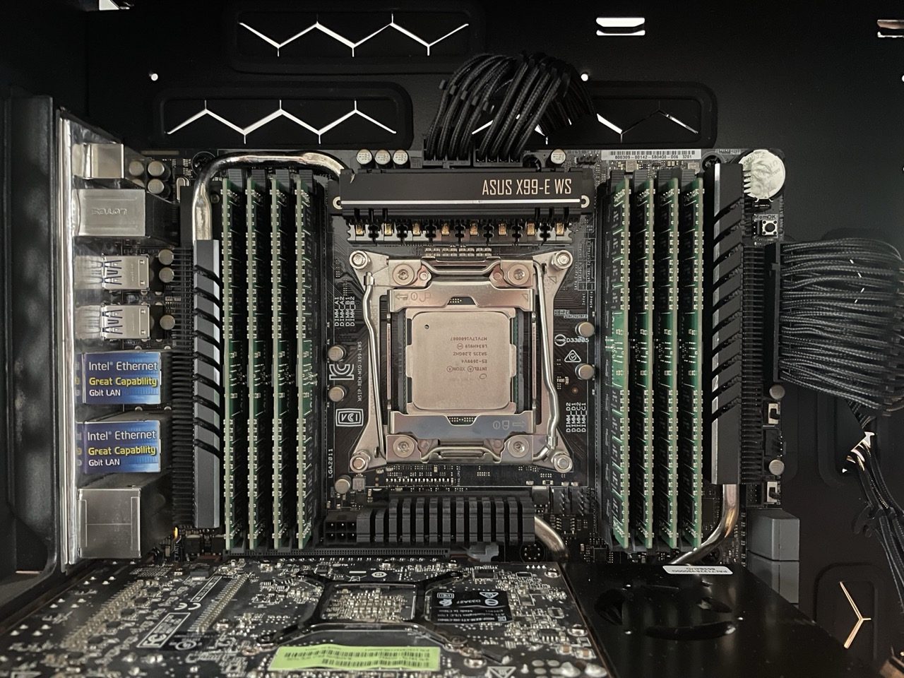
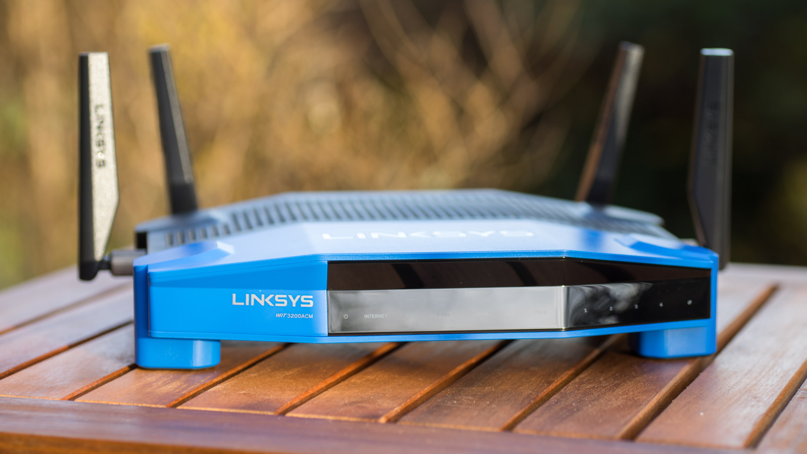
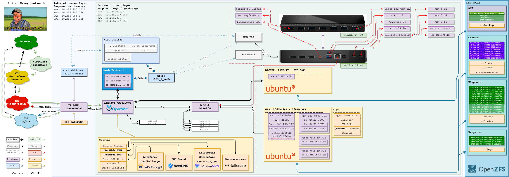

# Setting up HomeLab, and Networking with help of Ubuntu and Ansible

___N.A.S. - Nasaal, the Averager of the Storage___

> _One server to rule them all._<br>
  _One server to find them._<br>
  _One server to bring them all_<br>
  _and in the darkness store them._

[](./img/nas.jpeg)

__W.R.T. - Wireaal, Ruler of the Traffic__

> _One router to rule them all._<br>
  _One router to find them._<br>
  _One router to bring them all_<br>
  _and in the darkness bind them._

[](./wrt/Linksys_WRT3200ACM.jpg)

_Disclaimer: do this at your own risk. No fancy web GUI here (except monitoring), just raw Unix power._

## Table of Contents

- [Setting up HomeLab, and Networking with help of Ubuntu and Ansible](#setting-up-homelab-and-networking-with-help-of-ubuntu-and-ansible)
  - [Table of Contents](#table-of-contents)
  - [Articles](#articles)
  - [Overview](#overview)
    - [NAS Spec](#nas-spec)
    - [Linksys WRT3200ACM Spec](#linksys-wrt3200acm-spec)
    - [Original projects](#original-projects)
  - [NAS automation `(./00-nas)`](#nas-automation-00-nas)
    - [Cloud-install](#cloud-install)
      - [`autoinstall-generator.yml`](#autoinstall-generatoryml)
      - [`tools/prepare.sh`](#toolspreparesh)
      - [Ventoy](#ventoy)
    - [Ansible](#ansible)
    - [Extras](#extras)
  - [WRT automation `(./01-wrt)`](#wrt-automation-01-wrt)

## Articles

* https://www.nearshore-it.eu/articles/technologies/getting-started-with-homelab/

## Overview

[](./img/homeLayout.drawio.png)

### NAS Spec

* MoBo: Asus __X99-E WS__/USB 3.1
* CPU: Intel Xeon __E5-2699v4__ (22c/44t, 2.2GHz, 145W)
* RAM: __256GB__ (8 x 32GB) SK Hynix DDR4-2400 ECC RDIMM
* Bays: __21 x 3.5"__
* 7x PCI-E x16:
  * LSI SAS __9400-16i__ 16-port 12Gb/s SAS/SATA HBA
  * 2x Qnap __QM2-4P-384__ 4x M.2 NVMe
  * Radeon Pro __WX 7100__ 8GB
* LAN: 2 x 1 Gbit/s Ethernet
* Storage:
  * NVME: 1 x M.2 2280 __Samsung 980 PRO 1TB__
  * NVME: 8 x 2280 __WD Red SN700 2TB__
  * HDD: 8x 3.5" __WD UltraStar HC550 16TB__
  * HDD: 4x 3.5" __WD Red 4TB__

### Linksys WRT3200ACM Spec

* CPU: __Marvell Armada 385 88F6820__
* RAM: __512MB__
* Flash: __256MB__
* LAN: 4 x 1 Gbit/s Ethernet
* WLAN: 2.4GHz + 5GHz
* USB: 1 x 3.0

### Original projects

* [WD PR4100](https://github.com/aamkye/ubuntu_on_WD_PRx100)
* [HPE ProLiant G10](https://github.com/aamkye/ubuntu_on_HPE_ProLiant_MS_GEN10)
* [Custom FDD7](https://github.com/aamkye/ubuntu_on_fdd7)

## NAS automation `(./00-nas)`

### Cloud-install

#### `autoinstall-generator.yml`

Check [roles/autoinstall_generator/templates](roles/autoinstall_generator/templates) for more info.

```bash
> ansible-playbook autoinstall-generator.yml
```

#### `tools/prepare.sh`

Download chosen iso from [here](https://ubuntu.com/download/server), and run you fools:

```bash
> ./tools/prepare.sh <iso_path>/ubuntu-22.04.3-live-server-amd64.iso tmp/user-data-<generated>
```

#### [Ventoy](https://www.github.com/ventoy/Ventoy)

Place the iso on the USB stick, and boot from it.

### Ansible

Just run:

```bash
> cd ./playbooks/00-all
> ansible-playbook all_in_one.yml
```

... and watch the ___magic___.

### Extras

* [00-inventory.md](readme/zfs/00-inventory.md)
* [10-create-and-import.md](readme/zfs/10-create-and-import.md)
* [20-sanoid-config.md](readme/zfs/20-sanoid-config.md)
* [30-user-and-permission.md](readme/zfs/30-user-and-permission.md)
* [40-docker.md](readme/zfs/40-docker.md)
* [99-fuckup.md](readme/zfs/99-fuckup.md)

## WRT automation `(./01-wrt)`

TBD
